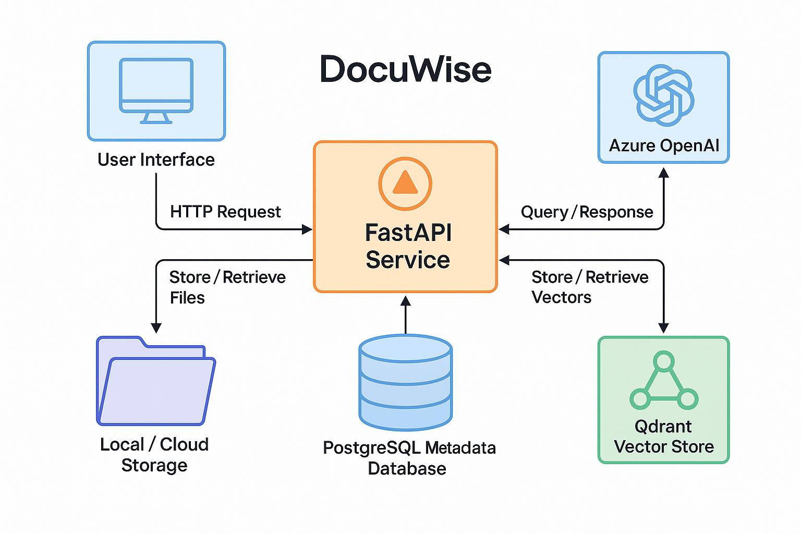
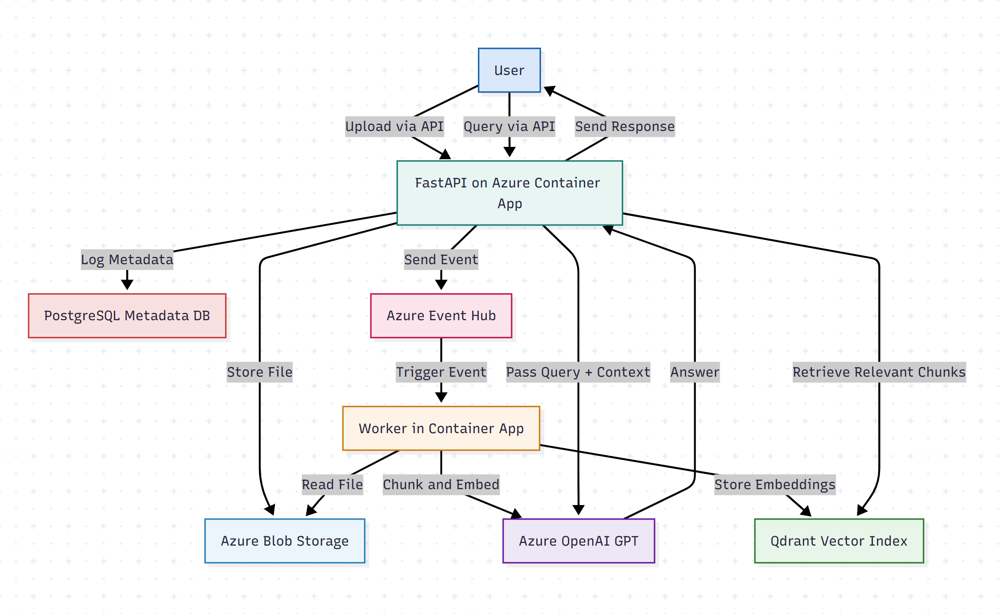
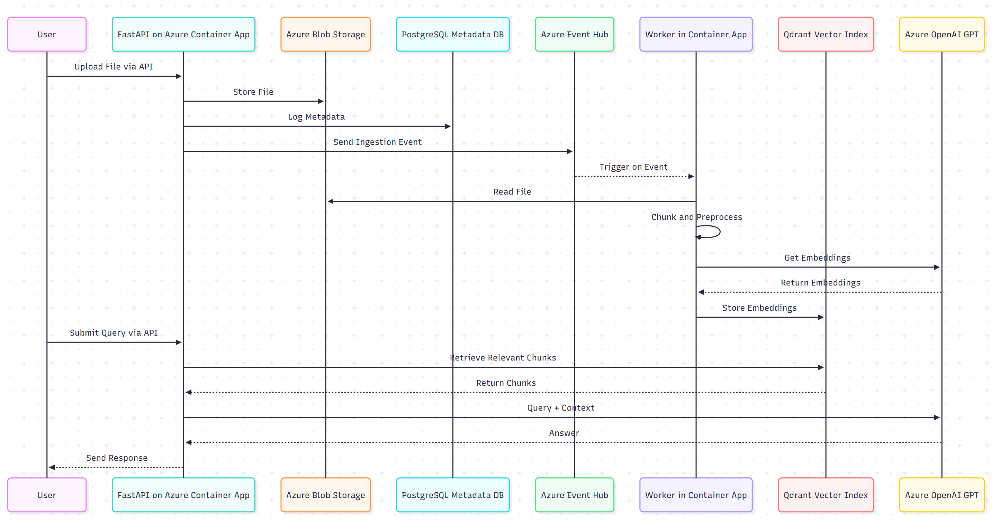

## 📖 Project Overview (Updated with Differentiators)

**DocuWise** is an end-to-end Retrieval-Augmented Generation (RAG) platform for building private, searchable Q&A over document collections. Unlike ChatGPT, DocuWise is designed to handle **user-uploaded files**, persist them, and provide structured access over time.

### 🚫 Why Not Just Use ChatGPT?
ChatGPT is a general-purpose chat model with no access to user-specific document memory. DocuWise goes beyond by offering:

- ✅ **Persistent vector search** over private PDFs
- ✅ **Database-backed file tracking** and user metadata
- ✅ **File-based question answering**, not just prompts
- ✅ **API and frontend access** with customized flows
- ✅ **Secure, localized control** for personal or enterprise use

---

## 🧩 Use Cases & Monetization Potential

DocuWise is ideal for turning niche hobbies or business domains into intelligent, document-aware assistants:

| Use Case | Target Audience | Differentiator |
|----------|------------------|----------------|
| **Hiking Guide Q&A** | Hikers, bloggers | Upload trail maps and guides, ask terrain/weather/gear questions |
| **Architecture Portfolio AI** | Designers, students | Query uploaded portfolios for materials, form, layout concepts |
| **Research Assistant** | Academics, students | Chat with uploaded research papers, persist Q&A context |
| **Contract Analyzer** | Freelancers, lawyers | Ask questions on uploaded client contracts, find key clauses |
| **Course Material Companion** | Learners, instructors | Upload class PDFs, query them topic-wise, persistent memory |
| **Document Vault SaaS** | Niche B2B markets | Offer private document Q&A SaaS to industries (HR, compliance, legal) |

### 💰 Monetization Paths
- Subscription plans based on document upload + usage
- Per-document or per-question billing
- Team-based pricing with file history and API access
- Offer vertical-specific SaaS solutions with branding

---

## 💾 Metadata Storage Enhancement

Uploaded PDFs are:
- Saved locally (or to Azure Blob)
- Tracked in MongoDB (or SQL) with:
  - `original_filename`
  - `stored_filename` (with timestamp)
  - `upload_time`
  - `file_size`
  - `path`
  - (optional) `user_id`, `status`

---

## 🧰 Tech Stack

- **Backend**: Python 3.9+, FastAPI
- **Database**: MongoDB *(flexible metadata)* or SQL (PostgreSQL/SQLite)
- **Vector Store**: FAISS (IndexFlatL2), later Qdrant
- **LLM**: Azure OpenAI (embedding + chat)
- **Frontend**: Next.js (planned)
- **PDF Parsing**: pypdf
- **Storage**: Local folder or Azure Blob (Terraform setup)
- **Infra**: Docker, GitHub Actions, Terraform
- **Dev Tools**: ruff, black, isort, pre-commit, mypy

---

## ✅ Completed Milestones (Weeks 1–2)

- Scaffolded codebase with pre-commit tools
- Built a working RAG MVP: upload → chunk → embed → FAISS → GPT chat
- Added FastAPI endpoints + timestamped uploads
- Refactored into services and routes

---

## 🎯 Full 18-Week Roadmap (With DB + Monetization Focus)

| Week | Focus                               | Outcome                                                            |
|------|-------------------------------------|--------------------------------------------------------------------|
| 3    | FastAPI `/upload` Scaffold          | Accept PDF, save with timestamp                                    |
| 4    | Mongo/SQL Metadata Storage          | Track file info in DB                                              |
| 5    | Modular Service Refactor            | `pdf_loader`, `chunker`, `embedder`, `indexer`                     |
| 6    | Frontend Scaffold                   | Upload UI + loading states                                        |
| 7    | Dockerize Services                  | Dockerfiles for API, Mongo, UI                                    |
| 8    | Docker Compose End-to-End           | Full local orchestrated setup                                     |
| 9    | Terraform: Azure Blob & Event Hub   | Blob setup via Terraform                                          |
| 10   | Function App + Index Pipeline       | Trigger Azure Function on file upload                             |
| 11   | Deploy Qdrant for Vector Store      | Move from FAISS to persistent Qdrant                              |
| 12   | Event-Driven Indexing               | Event Hub → Function → Qdrant                                     |
| 13   | Query API + Search Flow             | `/query` endpoint using DB and vector index                       |
| 14   | Frontend Q&A                        | Real-time Q&A + auth + file list                                  |
| 15   | CI/CD Pipeline                      | GitHub Actions + Docker build + Terraform                         |
| 16   | Monitoring & Alerts                 | App Insights, Azure Monitor                                       |
| 17   | Stripe Billing Integration          | Usage-tier billing with Stripe                                    |
| 18   | Final Polish + Launch Prep          | E2E tests, docs, responsive UI, production launch                 |

---

## 🏆 Final Deliverable

A production-ready, document-aware, cloud-native platform that enables users to query their files with AI — and helps you monetize your domain expertise as a standalone SaaS or portfolio project.

# Real World Use Cases Where this Beats ChatGPT:

| Use Case                 | Why DocuWise Wins                                                                            |
| ------------------------ | -------------------------------------------------------------------------------------------- |
| Legal Contract Assistant | Upload 100+ contracts, ask legal questions — **context lives inside your DB + vector store** |
| Research Companion       | Upload papers, persist summaries, track citations — ChatGPT resets on each session           |
| Corporate Intranet Tool  | Private PDF reports, meeting minutes, SOPs — **secure and internal**                         |
| Hobbyist Knowledge Vault | Upload hiking maps/guides — ChatGPT doesn’t let you *build a memory-based hiking bot*        |
| Education Assistant      | Upload class notes, textbooks — persistent, queryable context per user                       |
| Freelance Tool           | Let clients upload docs and query them — **you control access, monetization, billing**       |


## 💡 Why DocuWise Is More Than a ChatGPT Wrapper

You might ask: *“If people already use ChatGPT, why would they use DocuWise?”*

Here’s why DocuWise offers value that ChatGPT alone cannot:

---

### ✅ 1. Private Document Context (RAG)

ChatGPT cannot persist or reference a user’s PDFs across sessions.
**DocuWise stores documents, embeds them, and lets users query them with persistent memory.**

---

### ✅ 2. Targeted Domain Knowledge

ChatGPT is general-purpose.
**DocuWise performs retrieval and reasoning over a specific set of documents** — such as hiking guides, legal contracts, research papers, or personal notes.

---

### ✅ 3. Secure & Local File Handling

Users may not want to paste confidential PDFs into ChatGPT.
**DocuWise runs locally or privately, offering secure file upload + metadata tracking.**

---

### ✅ 4. Structured Metadata & Search

ChatGPT can’t track what file was uploaded, when, or by whom.
**DocuWise uses MongoDB/SQL to store metadata like upload time, filename, and file size — enabling search, filters, and usage logging.**

---

### ✅ 5. API & Custom Workflow Integration

Want to build document Q&A into your app?
**DocuWise exposes clean, customizable REST APIs** — you control ingestion, indexing, querying, and billing.

---

### ✅ 6. Monetizable Niche Use Cases

You can tailor DocuWise into a vertical SaaS:
- “Upload your legal docs and chat with them”
- “Ask questions about your hiking trail guides”
- “Search your architecture portfolio like an AI assistant”

**You own the data, the branding, and the monetization.**


# Standard DocuWise Project Structure
```
docuwise/
├── .venv/                             # Virtual environment (excluded from Git)
├── .env                               # Environment variables
├── .gitignore                         # Git ignore rules
├── .pre-commit-config.yaml            # Pre-commit hooks
├── requirements.txt                   # Python dependencies
├── README.md                          # Project documentation

├── data/                              # PDF storage
│   └── sample.pdf

├── app/                               # Core application code
│   ├── main.py                        # FastAPI app entrypoint
│   ├── __init__.py
│   ├── api/
│   │   └── routes/
│   │       ├── upload.py              # /upload route
│   │       ├── ingest.py              # /ingest route
│   ├── services/                      # Functional modules
│   │   ├── pdf_loader.py
│   │   ├── chunker.py
│   │   ├── embedder.py
│   │   ├── indexer.py
│   └── models/                        # Pydantic schemas
│       └── file_metadata.py

├── scripts/                           # One-off scripts
│   ├── demo.py
│   └── chat_demo.py

├── tests/                             # Unit tests
│   ├── __init__.py
│   ├── test_upload.py
│   └── test_ingest.py
```
----
#### High Level Architecture Diagram


----
#### Detailed Architecture Diagram


----
#### Sequence Diagram

